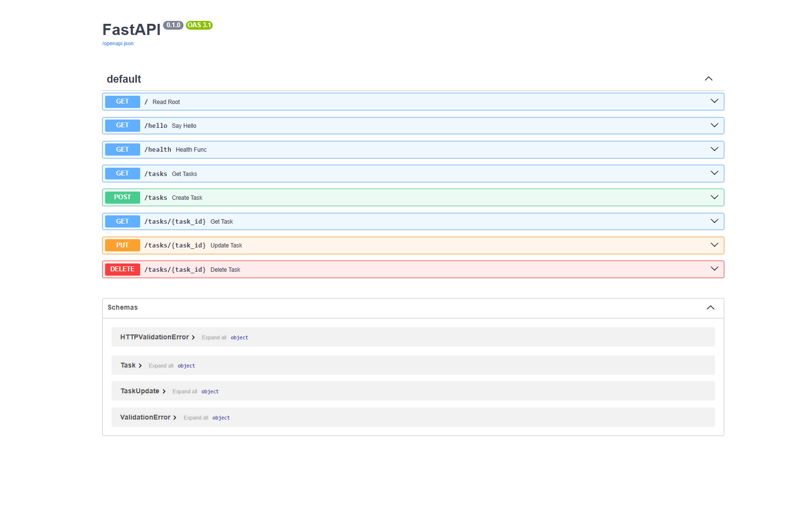

# To-Do CRUD API

A small REST API for managing a to-do list, built with FastAPI as part of the FlyRank backend internship (Week 2).

Data is stored in memory only — it resets every time the server restarts. No database yet, that's next week.

## How to run it

**Requirements:** Python 3.10+ and pip.

1. Install dependencies:
   ```
   pip install fastapi uvicorn
   ```

2. Run the server:
   ```
   uvicorn main:app --reload
   ```

3. The API is now running at `http://localhost:8000`. Interactive docs (Swagger UI) are at `http://localhost:8000/docs`.

## Endpoints

| Method | Path | Description |
|---|---|---|
| GET | `/` | API info |
| GET | `/health` | Health check |
| GET | `/tasks` | List all tasks |
| GET | `/tasks/{task_id}` | Get a single task |
| POST | `/tasks` | Create a new task |
| PUT | `/tasks/{task_id}` | Update a task |
| DELETE | `/tasks/{task_id}` | Delete a task |

## Example request

Creating a task:

```
curl -i -X POST http://localhost:8000/tasks -H "Content-Type: application/json" -d "{\"title\":\"Buy milk\"}"
```

Response:

```
HTTP/1.1 201 Created
content-type: application/json

{"id":4,"title":"Buy milk","done":false}
```

## Swagger UI

All endpoints tested and working via the interactive docs at `/docs`:



## Notes

- Validation errors (e.g. missing `title` on POST) return `422 Unprocessable Content` rather than `400 Bad Request` — this is FastAPI/Pydantic's default behavior for schema validation failures, and was kept as-is rather than overridden.
- Since data is in-memory only, restarting the server resets the task list back to the 3 example tasks.
